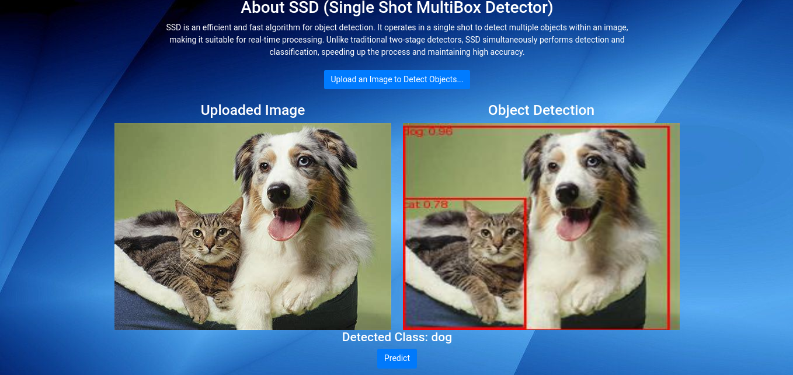

### Introduction
An object detection model that incorporates Single Shot MultiBox Detector (SSD) to detect objects from five classes, female individual, male individual, cat, dog, and bicycle.
The web app (built on Flask) allows for a user to upload a photo which is then send to the backend for detection and the result returned to the frontend. 

### Data
* The images used for training and validation are stored in the Images.zip file
* The corresponding PASCAL VOC-XML files are stored in the xml.zip file

### Running the Project
* Clone the repository using `git clone https://github.com/Gson-glitch/SSD-Flask-App.git`
* Create a virtual environment or use an existing one and activate it.
* Navigate into the project folder, **SSD-Flask-App**. 
* Install the required libraries using `pip install -r requirements.txt`
* Start the server by runnnig `flask --app app.py run` 
* Once the started is started open the URL: http://127.0.0.1:5000 in your browser.
* Interact with the app.

### Sample Detections
#### Single Class

<h5>Dog Detection</h5>

 

<h5>Cat Detection</h5>

#### Multi-Class

<h5>Dog and Cat Detection</h5>

